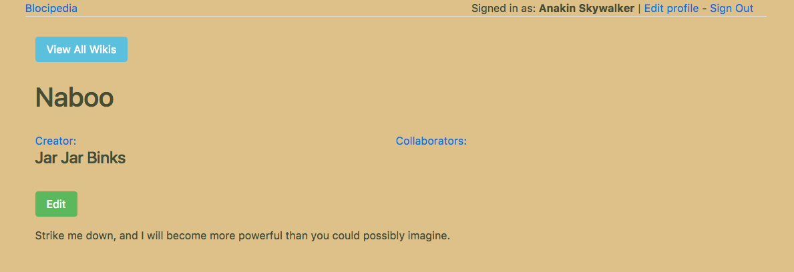

# Blocipedia

**An app that allows users to create public and private Markdown-based wikis.**

### How It Works
* **MVC** architecture with `wiki`, `user`, and `collaborator` models
* **Has Many Through** data relationship to create collaborations
* **Devise** for signing up and logging in
* **Pundit** for authorization
* **Faker** for seeding data
* **Stripe** for handling credit card payments
* **Bootstrap** for styling
* **Redcarpet** to allow Markdown syntax
